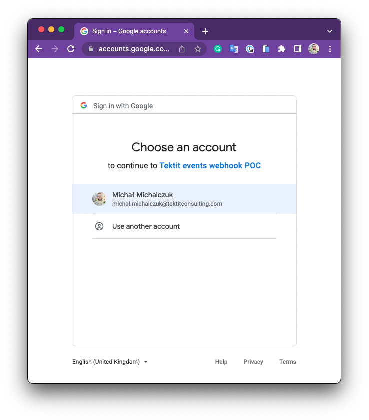

# Google calendar events webhook POC

This repository contains sample integration with google calendar events webhooks, which you can run
fully locally.

- [How it works?](#how-it-works)
- [Specs for Google Calendar Events webhook](#specs-for-google-calendar-events-webhook)
  - [Webhook creation](#webhook-creation)
    - [Request to googleapis.com](#request-to-googleapiscom)
    - [Webhook expiration](#webhook-expiration)
    - [Response from googleapis.com](#response-from-googleapiscom)
  - [Webhook callback](#webhook-callback)
    - [Request to `~/webhook` send by Google API](#request-to-webhook-send-by-google-api)
    - [Response from `~/webhook` to Google API](#response-from-webhook-to-google-api)
  - [Fetching recent changed events](#fetching-recent-changed-events)
  - [Limits](#limits)
- [Run it](#run-it)
  - [Prerequisites](#prerequisites)
    - [You have Node & npm installed](#you-have-node--npm-installed)
    - [You have Google Cloud account](#you-have-google-cloud-account)
  - [Run the app](#run-the-app)
  - [Play with the calendar](#play-with-the-calendar)
  - [Everything is in memory](#everything-is-in-memory)
  - [Tips](#tips)

## How it works?

## Specs for Google Calendar Events webhook

[Calendar API docs for push notifications](https://developers.google.com/calendar/api/guides/push)
describes it well, highly recommend reading them.

Still, a few things done there are worth mentioning:

### Webhook creation

`POST https://www.googleapis.com/apiName/apiVersion/resourcePath/watch`

- f.e. `POST https://www.googleapis.com/calendar/v3/calendars/my_calendar@gmail.com/events/watch`

#### Request to googleapis.com

While registering webhook, the client is responsible for creating channel id (`id`) and channel
token `token`

- `id` has to be always unique, is echoed by `X-Goog-Channel-Id` header in the webhook callback
  request

- `token` is optional and can help dispatch webhook callbacks in application logic.

  - Example of usage: You can register multiple webhooks for the same callback address with channels
    tokens `target=all-events` or `target=recent-event` or `source=mobile-app&target=all-events` and
    when receiving the callback with channel token execute different logic

- `expiration` is optional, but you can register webhook with a custom expiration time

- `address` is the webhook callback URL. When this doc mentions _webhook callback_ it means this
  very app URL which is called by Google if there is a new notification

#### Webhook expiration

Channels are not automatically re-created, they have to be recreated manually when expired.

#### Response from googleapis.com

Response mainly echoes what was sent. Important - it sends back the `expiration` as the timestamp.

Example response:

```json
status: 200
data: {
    "kind": "api#channel",
    "id": "a0b94ba9-a752-4518-bdfb-059c9933a579",
    "resourceId": "8pNgdSzwS_emx0WZgp30VdgdstE",
    "resourceUri": "https://www.googleapis.com/calendar/v3/calendars/primary/events?alt=json",
    "token": "channel=all_events",
    "expiration": "1667474712000"
}
headers: {
    "alt-svc": "h3=\":443\"; ma=2592000,h3-29=\":443\"; ma=2592000,h3-Q050=\":443\"; ma=2592000,h3-Q046=\":443\"; ma=2592000,h3-Q043=\":443\"; ma=2592000,quic=\":443\"; ma=2592000; v=\"46,43\"",
    "cache-control": "no-cache, no-store, max-age=0, must-revalidate",
    "connection": "close",
    "content-encoding": "gzip",
    "content-type": "application/json; charset=UTF-8",
    "date": "Thu, 27 Oct 2022 11:25:13 GMT",
    "expires": "Mon, 01 Jan 1990 00:00:00 GMT",
    "pragma": "no-cache",
    "server": "ESF",
    "transfer-encoding": "chunked",
    "vary": "Origin, X-Origin, Referer",
    "x-content-type-options": "nosniff",
    "x-frame-options": "SAMEORIGIN",
    "x-xss-protection": "0"
}
```

### Webhook callback

App URL which is called by Google if there is a new notification. F.e. example:
`https://some-origin.example.com/webhook`

This example app uses [ngrok](https://ngrok.com/) to temporarily expose localhost through a secure tunnel. Example of webhook callback which was registered to Google Calendar API by this app:
`https://1234-93-174-30-12.ngrok.io/webhook`

Previously, this app used [localtunnel](https://github.com/localtunnel/localtunnel) which exposed localhost via a loca.lt subdomain (e.g. `https://mean-wolves-invent-93-174-30-12.loca.lt/webhook`).

#### Request to `~/webhook` send by Google API

The request (from Google API) to the webhook callback **doesn't contain any information about what
has changed in the event(s)**, it only indicates that there was a change on a watched resource.

All data we get is set of `X-Goog-...` headers as
[listed in documentation](https://developers.google.com/calendar/api/guides/push#headers).

Most important ones:

- `X-Goog-Channel-ID` is `id` of channel, the same as we gave during registration
- `X-Goog-Channel-Token` is `token` of the channel, the same as we gave during registration
- `X-Goog-Channel-Expiration` when webhook will expire
- `X-Goog-Resource-State` first call to the webhook callback will be `sync`. This header holds this
  information. Further requests will be `exists` or `not_exists`. `not_exists` sounds like it should
  be sent when resource to which we subscribe is deleted, but I didn't manage to get this state when
  I removed the calendar.

Example request for `sync`

```json
body: <empty>
headers: {
   "accept-encoding": "gzip, deflate, br",
   "user-agent": "APIs-Google; (+https://developers.google.com/webmasters/APIs-Google.html)",
   "x-goog-channel-token": "channel=all_events",
   "x-goog-resource-uri": "https://www.googleapis.com/calendar/v3/calendars/primary/events?alt=json",
   "x-goog-resource-id": "8pNgdSzwS_emx0WZgp30VdgdstE",
   "x-goog-message-number": "1",
   "x-goog-resource-state": "sync",
   "x-goog-channel-expiration": "Thu, 03 Nov 2022 12:41:23 GMT",
   "x-goog-channel-id": "d1f846c0-730c-4854-860d-b1abfdf8518d",
   "accept": "*/*",
   "content-length": "0",
   "x-forwarded-port": "443",
   "x-forwarded-ssl": "on",
   "x-forwarded-proto": "https",
   "x-forwarded-for": "74.125.210.38",
   "x-real-ip": "74.125.210.38",
   "connection": "close",
   "host": "mean-wolves-invent-93-174-30-12.loca.lt",
   "x-forwarded-host": "mean-wolves-invent-93-174-30-12.loca.lt"
}
```

Example request for `exists`

```json
body: <empty>
headers: {
   "accept-encoding": "gzip, deflate, br",
   "user-agent": "APIs-Google; (+https://developers.google.com/webmasters/APIs-Google.html)",
   "x-goog-channel-token": "channel=all_events",
   "x-goog-resource-uri": "https://www.googleapis.com/calendar/v3/calendars/primary/events?alt=json",
   "x-goog-resource-id": "8pNgdSzwS_emx0WZgp30VdgdstE",
   "x-goog-message-number": "100566",
   "x-goog-resource-state": "exists",
   "x-goog-channel-expiration": "Thu, 03 Nov 2022 12:41:23 GMT",
   "x-goog-channel-id": "d1f846c0-730c-4854-860d-b1abfdf8518d",
   "accept": "*/*",
   "content-length": "0",
   "x-forwarded-port": "443",
   "x-forwarded-ssl": "on",
   "x-forwarded-proto": "https",
   "x-forwarded-for": "74.125.210.38",
   "x-real-ip": "74.125.210.38",
   "connection": "close",
   "host": "mean-wolves-invent-93-174-30-12.loca.lt",
   "x-forwarded-host": "mean-wolves-invent-93-174-30-12.loca.lt"
}
```

#### Response from `~/webhook` to Google API

The status of the response send by webhook callback is a crucial part of the contract.

- `200`, `201`, `202`, `204`, `102` - request correctly handled, waiting for next
- `500`, `502`, `503`, `504` - request will be retried with exponential backoff
- any other status code - the message is a failure, won't be retried

### Fetching recent changed events

Since the webhook callback request doesn't contain information about what has changed, we have to
fetch events on our own. There is `updatedMin` param for
[Events List endpoint at Google Calendar API](https://developers.google.com/calendar/api/v3/reference/events/list)
which gives us all events which were updated since the given time.

### Limits

Google Cloud doesn't specify any limits for the number of registered webhooks. Requests for
registration (/watch) are counted for the whole `Google Calendar API` quota.

---

## Run it

### Prerequisites

#### You have Node & npm installed

- https://nodejs.org/en/
- highly recommended to play with Node.js versions - https://github.com/nvm-sh/nvm

#### You have Google Cloud account

To play with [Google Calendar API](https://developers.google.com/calendar/api) you need to have
Google Cloud account with the project in it and

1. Sign in to [console.cloud.google.com/](https://console.cloud.google.com/) with your Google
   account
1. Create a new project
1. Setup consent screen, adding `https://www.googleapis.com/auth/calendar.events ` as the required
   scope there
1. Add credentials for OAuth client ID, for application type "Web Application"
1. Store generated credentials

### Run the app

1. Copy `.env.template` as `.env` and fill in the variables there. Put there the credentials you've
   generated at Google Cloud
1. Run `npm ci` to install dependencies
1. Run `npm run dev` to run the app

- it is run in watch mode

The expected result in the console

```sh
[INFO] 17:18:55 ts-node-dev ver. 2.0.0 (using ts-node ver. 10.9.1, typescript ver. 4.8.4)
[17:18:55.746] INFO (93845): Server listening at http://127.0.0.1:3031
```

### Play with the calendar

1. Open [http://localhost:3031/redirect](http://localhost:3031/redirect) to be redirected directly
   to app consent screen 
1. You will be redirected to `http://localhost:3031/callback`, the webhook will be registered while
   handling the callback
1. Play with Google Calendar (of the user which account you authorized in the previous step) -
   add/update/delete some events
1. Observe the changed events on `http://localhost:3031/events`

### Everything is in memory

⚠️ All data and tokens are stored in memory. If you re-spawn the process please **remember to
authorize again via http://localhost:3031/redirect**

### Tips

If at some point you'd like to clear stored events - just call
`DELETE http://localhost:3031/events endpoint`

If you'd like to check URL for Google auth, go to root `http://localhost:3031`

⚠️ [localtunnel](https://github.com/localtunnel/localtunnel) which is used for exposing localhost to
the internet is moody and can kill the connection (or subdomain) after few minutes. Restart the
server (kill the `npm run dev` task, and run it one more time) to expose under new address and
register new webhook. Good point is - you don't have to create any account to use it :)
